# TP 1 grilles de mot de passe

Ce projet pédagogique implémente un système de génération de mots de passe basé sur des grilles et des chemins de déplacement. Le programme permet de créer des grilles aléatoires de caractères, de définir des chemins de déplacement dans ces grilles, et de générer des mots de passe en suivant ces chemins.

- **Teacher**: Ludovic SAINT-BAUZEL - mail: saintbauzel@isir.upmc.fr
- **Student**: William WU - mail: william.wu@etu.sorbonne-universite.fr

## Main files

* password.pdf : le sujet 
* main.cc : Un programme de test à modifier selon les besoins
* Makefile : le makefile pour le main ou les tests unitaires
* path.hh et path.cc : les fichiers qui définissent la classe `Path`
* passgrid.hh et passgrid.cc : les fichiers qui définissent la classe `PassGrid`
* tests : répertoire de test unitaires ( TestCase.cc ) en utilisant le doctest.h

## Pour la compilation (sous Windows)

#### **À noter que les fichiers Makefile ont été modifiés et adaptés pour Windows !!!**

```bash
make                    # Compile le programme principal
make --directory=tests  # Compile les tests unitaires
./main                  # Exécute le programme
tests/testcase.exe      # Exécute les tests
```

## Pour `clean` le répository

```bash
make clean                      # Compile le programme principal
make clean --directory=tests    # Compile les tests unitaires
```

## Diagramme UML

*Diagramme UML, fait à l'aide de l'ia et de Mermaidchart.*




## Github

*Lien personnel du github pour cette séance de tp.*

https://github.com/williamwu8888/Cpp_programming_M2/tree/master/_practicals/tp1_password