# TP2: Three-Valued Logic Expression Evaluator

A C++ implementation of a three-valued logic system supporting True (T), False (F), and Unknown (U) values with logical operators for building and evaluating complex expressions.

- **Teacher**: Ludovic SAINT-BAUZEL - mail: saintbauzel@isir.upmc.fr
- **Student**: William WU - mail: wuwilliam2003@gmail.com

## Overview

This project provides a framework for working with three-valued logic, where propositions can have three possible truth values:
- **T** - True
- **F** - False  
- **U** - Unknown/Undefined

The system includes atomic propositions and logical operators (AND, OR, NOT) that follow ternary logic evaluation rules.

## Features

- **Atom Class**: Represents atomic propositions with unique identifiers
- **Logical Operators**:
  - `ExpAnd`: Logical AND operator
  - `ExpOr`: Logical OR operator  
  - `ExpNot`: Logical NOT operator
- **Ternary Logic Evaluation**: Proper handling of all three truth values in logical operations
- **Expression Tree**: Build complex logical expressions by combining operators and atoms
- **Comprehensive Testing**: Unit tests using the doctest framework

## Project Structure

project/
├── headers/ # Header files
│ ├── ExpLog.hh # Base expression class and ThreeVal enum
│ ├── Atom.hh # Atomic proposition class
│ ├── ExpBin.hh # Base binary expression class
│ ├── ExpAnd.hh # AND operator
│ ├── ExpNot.hh # NOT operator
│ └── ExpOr.hh # OR operator
├── src/ # Implementation files
│ ├── Atom.cc
│ ├── ExpLog.cc
│ ├── ExpNot.cc
│ ├── ExpAnd.cc
│ └── ExpOr.cc
└── test/ # Test suite
├── TestCase.cc # Comprehensive unit tests
├── catch.hpp # Testing framework
├── doctest.h
└── Makefile



## Truth Tables

### NOT Operator
| Input | Output |
|-------|--------|
| T     | F      |
| F     | T      |
| U     | U      |

### AND Operator
| A \ B | T | F | U |
|-------|---|---|---|
| T     | T | F | U |
| F     | F | F | F |
| U     | U | F | U |

### OR Operator
| A \ B | T | F | U |
|-------|---|---|---|
| T     | T | T | T |
| F     | T | F | U |
| U     | T | U | U |

## Usage Examples

```cpp
// Create atoms with different truth values
Atom a(ThreeVal::T), b(ThreeVal::U), c(ThreeVal::F);

// Create logical expressions
ExpNot notExpr(a);                    // !a
ExpAnd andExpr(notExpr, b);           // !a & b
ExpOr orExpr(andExpr, c);             // (!a & b) | c

// Evaluate expressions
ThreeVal::ThreeVal_t result = orExpr.evaluate();

// Convert to string representation
std::string exprStr = orExpr.toString();
```

## Building and Testing

### Prerequisites

- C++ compiler with C++11 support
- Make build system

### Building Tests

```bash
cd test
make
.\testcase.exe
```

### Running Tests

The test suite verifies:
- Atom creation and evaluation
- Logical operator functionality
- Expression tree building and evaluation
- Assignment operations
- String representation

### Key Classes

- ExpLog: Abstract base class for all logical expressions
- Atom: Atomic proposition with unique ID and truth value
- ExpBin: Base class for binary operators
- ExpAnd: Logical AND operator
- ExpOr: Logical OR operator
- ExpNot: Logical NOT operator

### License

This project is intended for educational purposes as part of a programming exercise.